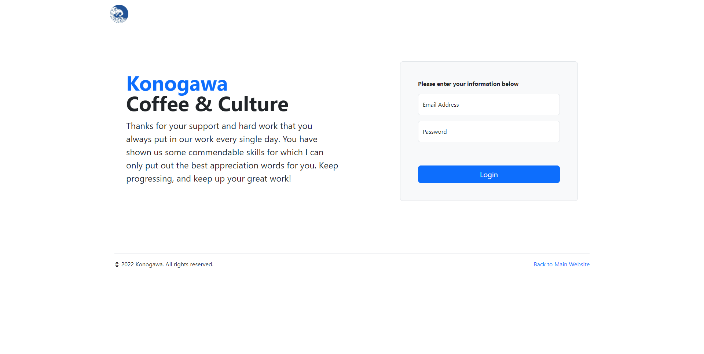

# Cafe Website & Admin Panel

A full-featured website with an integrated **Admin Panel** developed using **Laravel**, **Bootstrap**, and **jQuery**.  
The website provides public-facing cafe information while the Admin Panel enables staff to manage operations.

---

## 🌟 Features

### Public Website
- 📖 **Cafe Story**: Background and history of the cafe  
- 🍴 **Menu Display**: Browse available products  
- 📍 **Contact & Maps**: Location and contact details  
- 💬 **Feedback Page**: Customers can send suggestions and comments  

### Admin Panel
- 🛠 **Product Management**: Add, edit, delete products  
- 📦 **Order Management**: View and track customer orders (from website & mobile app)  
- 📰 **News & Announcements**: Post updates for customers  
- 💬 **Feedback Management**: Review and respond to customer input  
- 👥 **Account Management**: Manage staff and user accounts  

---

## 🛠 Tech Stack

- **Frontend:** Bootstrap, jQuery  
- **Backend:** Laravel  
- **Database:** MySQL  
- **API:** RESTful API to communicate with the mobile app  

---

## 🚀 Workflow

1. Public users can view menu, cafe info, maps, and send feedback.  
2. Customers place orders via the mobile app.  
3. Orders are sent to the Laravel server and displayed in the **Admin Panel**.  
4. Staff manages orders, menus, accounts, and feedback through the Admin Panel.  

---

## 📌 Future Improvements

- Integration with payment gateway  
- Advanced analytics dashboard for staff  
- Role-based access control  

---

## 📷 Screenshots

- Website

- Admin Panel

---

## 👨‍💻 Author
Developed by **kloriine**
